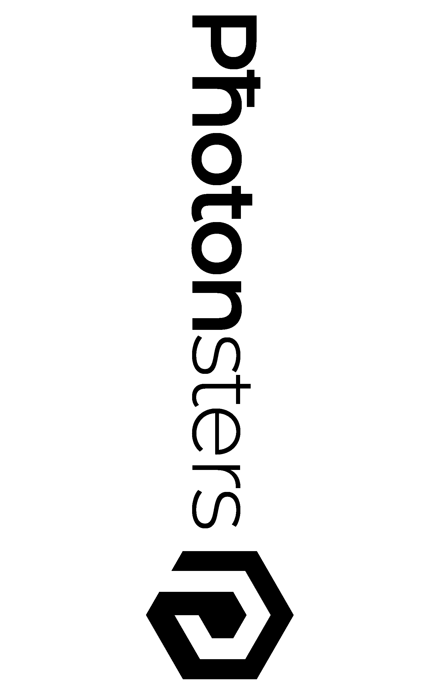
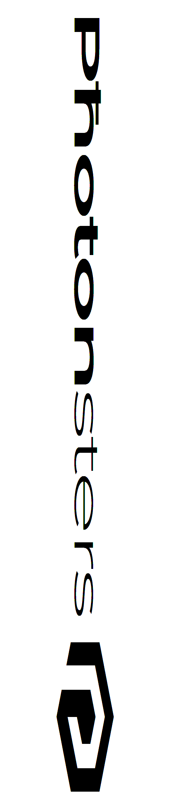

**monoMSLAConvert.py** - A script that takes a 1/3 resoluiton rgb-encoded mono MSLA printer image and converts it to full-resolution grayscale.  Or vice-versa.  It will check the image type of the input file and decide from that which direction you wish to convert.

